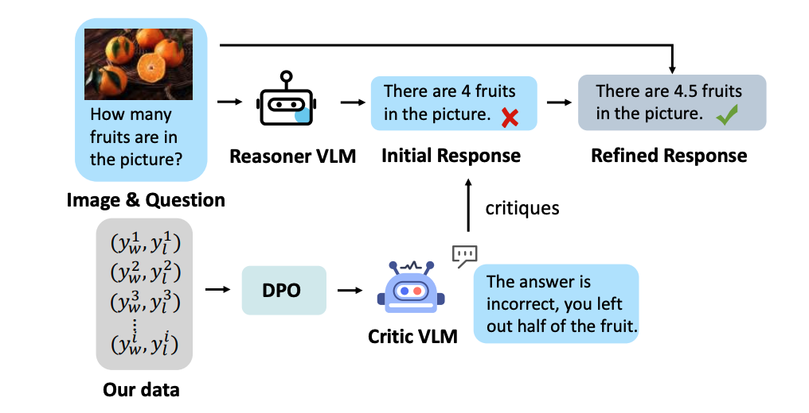

# [🏆CVPR2025] Critic-V: VLM Critics Help Catch VLM Errors in Multimodal Reasoning

[📝Paper Arxiv](https://arxiv.org/abs/2411.18203) | [🤗Huggingface Dataset](https://huggingface.co/datasets/huaXiaKyrie/critique-VQA)

Official Repository for CVPR 2025 paper Critic-V: VLM Critics Help Catch VLM Errors in Multimodal Reasoning.


<p align="center">
    
</p>

## Getting Started

```
git clone https://github.com/kyrieLei/Critic-V.git
cd Critic-V
```

## Data Generation

### Error Injection

```
cd data_utils/inject
python data_utils/inject/error_inject.py
```

### Error Detection

```
cd data_utils/detect
python data_utils/detect/error_detect.py
```
After running this, for instance, you need to change the following name in your json files
```
"num_detections": "4",
"detection_1": "The woman is not playing with a small dog.",
"detection_2": "There is no picnic set up in the background.",
"detection_3": "A rainbow does not appear to be forming in the sky.",
"detection_4": "The woman is not just preparing to fly the kite; she is already holding it.",
```
to 
```
"model1_num_detections": "4",
"model1_detection_1": "The woman is not playing with a small dog.",
"model1_detection_2": "There is no picnic set up in the background.",
"model1_detection_3": "A rainbow does not appear to be forming in the sky.",
"model1_detection_4": "The woman is not just preparing to fly the kite; she is already holding it.",

```

### Score Computation

```
cd data_utils/score_compute/score_compute.py
python data_utils/score_compute/score_compute.py
```

## Citation

If you find our code or paper useful, please cite as:

```
@article{zhang2024critic,
  title={Critic-V: VLM Critics Help Catch VLM Errors in Multimodal Reasoning},
  author={Zhang, Di and Lei, Jingdi and Li, Junxian and Wang, Xunzhi and Liu, Yujie and Yang, Zonglin and Li, Jiatong and Wang, Weida and Yang, Suorong and Wu, Jianbo and others},
  journal={arXiv preprint arXiv:2411.18203},
  year={2024}
}
```
