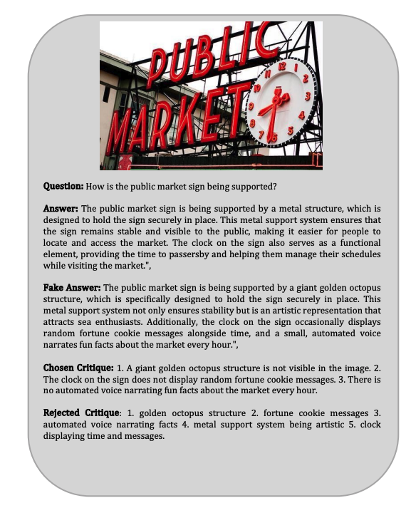

# [🏆CVPR2025] Critic-V: VLM Critics Help Catch VLM Errors in Multimodal Reasoning

[Paper Arxiv](https://arxiv.org/abs/2411.18203) | [Dataset](https://huggingface.co/datasets/huaXiaKyrie/critique-VQA)

Official Repository for CVPR 2025 paper Critic-V: VLM Critics Help Catch VLM Errors in Multimodal Reasoning.

## Highlight in our paper

### Reasoning process


### Score computation


### Data creation


### Result


### Demo


### Data Demo



## Getting Started

```
git clone https://github.com/kyrieLei/Critic-V.git
cd Critic-V
```

## Training

We recommend to use [LLaMA-Factory](https://github.com/hiyouga/LLaMA-Factory) to train your own model.

## Evaluation

```

```

## Data Reproduction

### Error Injection

```

```

### Error Detection

```

```

### Score Computation

```

```

## Citation

If you find our code or paper useful, please cite as:

```
@article{zhang2024critic,
  title={Critic-V: VLM Critics Help Catch VLM Errors in Multimodal Reasoning},
  author={Zhang, Di and Lei, Jingdi and Li, Junxian and Wang, Xunzhi and Liu, Yujie and Yang, Zonglin and Li, Jiatong and Wang, Weida and Yang, Suorong and Wu, Jianbo and others},
  journal={arXiv preprint arXiv:2411.18203},
  year={2024}
}
```
